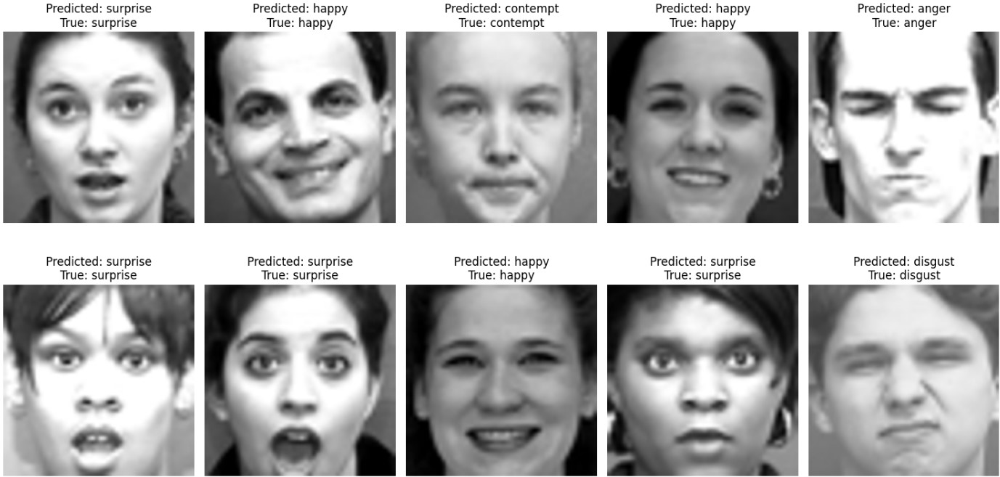
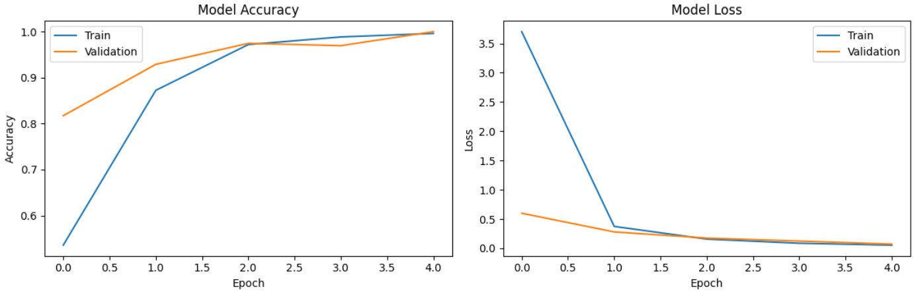

# Facial Expression Recognition (FER) Project

This project implements a deep learning-based Facial Expression Recognition system using a VGG16-based architecture, CK+ dataset. The system is capable of detecting and classifying human facial expressions in real-time.

## Project Overview

The Facial Expression Recognition system uses a convolutional neural network (CNN) based on the VGG16 architecture to classify facial expressions into different emotional categories.

## Features

- Real-time facial expression recognition
- Pre-trained VGG16 model adaptation
- Training performance visualization
- Multi-class emotion classification

## Results

The model has been trained and evaluated on a facial expression dataset. Here are some of the results:

### Training Performance

The following graph shows the model's training performance:

## Project Structure

- `Facial_Expression_Recognition_(FER).ipynb`: Main Jupyter notebook containing the implementation
- `Images/`: Directory containing project images and visualizations
  - `VGG16_Architecture.png`: VGG16 model architecture visualization
  - `Results.jpg`: Model prediction results
  - `Training Performance Visualization.jpg`: Training metrics visualization

## Technologies Used

- Python
- TensorFlow/Keras
- OpenCV
- NumPy
- Matplotlib
- Jupyter Notebook

## Setup and Installation

1. Clone this repository
2. Install the required dependencies
3. Open and run the Jupyter notebook `Facial_Expression_Recognition_(FER).ipynb`

## Contact

If you have any questions or feedback, feel free to contact me at [Maazouz AbdelAziz](https://www.linkedin.com/in/abdelaziz-maazouz/).

